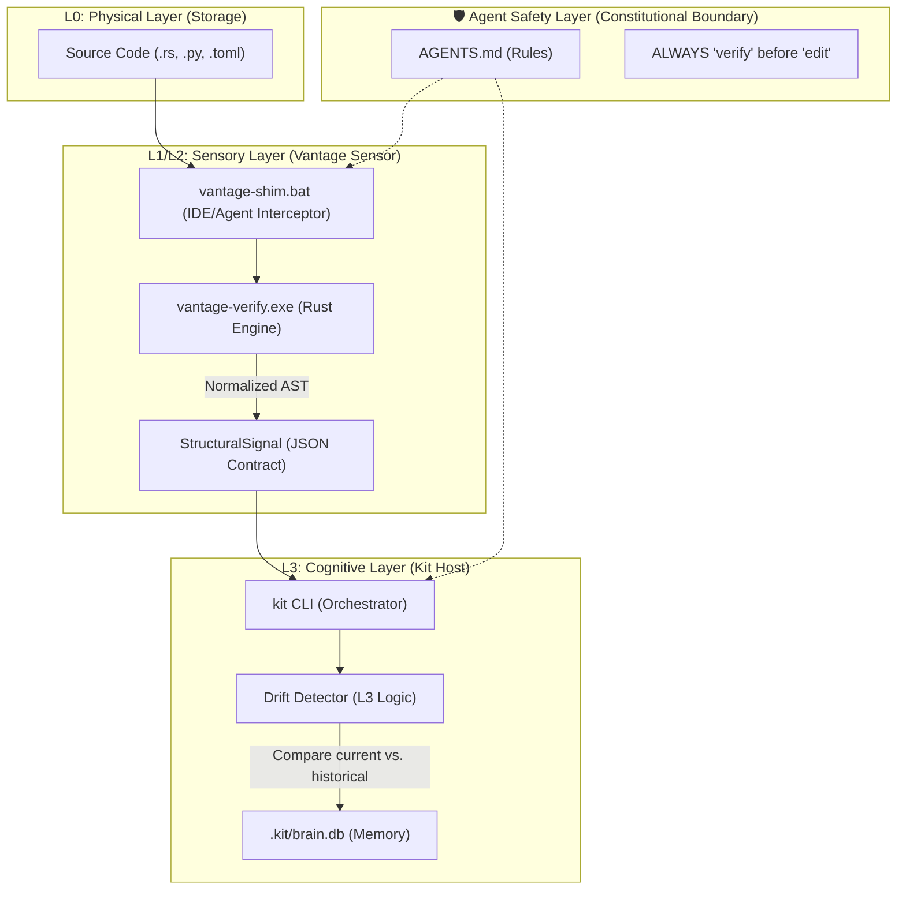

# Vantage Architecture: The Unified Cognitive Pipeline (v1.2.3)

Vantage is a **Stateless Structural Abstraction Sensor** designed to provide deterministic "ground truth" for the `kit` cognitive host. It operates as the L2 (Structural) layer, converting physical source code into symbolic signals.

---

## 📡 1. The Unified Cognitive Pipeline

This diagram illustrates the flow from a physical file change to a cognitive memory update in `kit`.

---

## 🛡️ 2. The Agent Safety Layer

The Agent Safety Layer is a set of **Non-Negotiable Invariants** enforced through the structural sensor:

1.  **Lazy Hydration**: Agents are forbidden from reading raw file contents by default. They must first call `vantage verify` to see the "Abstraction".
2.  **Structural Guard**: Files with `@epistemic` markers are "Locked". Any `structural_hash` change is flagged as a potential violation.
3.  **Deterministic Abstraction**: The `normalized_hash` ensures that the Agent isn't confused by "noise" (whitespace/comments), preventing halluncinations during structural reasoning.
4.  **No Cross-Repo Leakage**: The sensor is strictly scoped to the project root.

---

## ⚡ 3. The `vantage-shim` Flow

The `vantage-shim.bat` (or shell equivalent) acts as a high-speed interceptor for Agent tool-calls:

-   **Input**: A path to a source file.
-   **Action**: Calls `vantage verify --json`.
-   **Output**: Returns the `StructuralSignal` block to the Agent.
-   **Benefit**: This saves thousands of tokens by preventing the Agent from "swallowing" the whole file to understand its structure. The Agent only sees the **Signals**.

---

## 🧬 4. Cryptographic Integrity: The Double Lock

| Lock Type | Source | Invariant | Purpose |
| :--- | :--- | :--- | :--- |
| **Physical** | `structural_hash` | Byte-identical | Detects file-level tampering or unauthorized edits. |
| **Structural** | `normalized_hash` | AST-identical | Detects functional changes while ignoring formatting. |

---

🛡️ **VANTAGE v1.2.3 - CERTIFIED STRUCTURAL SENSOR** 🛡️
