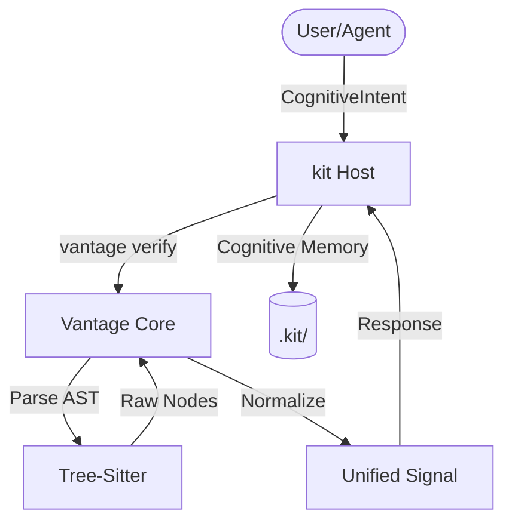

# Vantage Architecture (v1.2.3)

Vantage is a **Structural Sensor** designed to integrate as a specialized plugin for the `kit` cognition system. It provides high-precision structural signals (L2) derived from deterministic AST analysis.

---

## 1. System Positioning: Vantage as a Sensor
Vantage is not a standalone "brain" or "memory" layer. It is a passive sensor serving the `kit` platform.

* **Host (kit)**: Owns the memory layer (`.kit/`), manages high-level logic, and orchestrates agents.
* **Sensor (Vantage)**: Provides structural "eye" capabilities. Maps physical code (Geometry) to logical symbols (Abstraction).

---

## 2. Core Philosophy: Structural Abstraction
Vantage operates on the principle that while logic changes, **Structure** remains the most stable anchor for cognitive memory.

1. **Geometry (L0)**: The physical location and byte range of code targets.
2. **Structure (L1)**: The AST-normalized shape hash of a target.
3. **Abstraction (L2)**: The Unified Symbol Signal (name, type, signature).

---

## 3. Interaction Model: Intent-Driven
All interactions with Vantage follow the **Request-Response** pattern. It never runs in the background.

---

## 4. Logical Components

### 4.1 Parser (The Lens)
Responsible for language-specific extraction. Maps `tree-sitter-rust` or `tree-sitter-python` nodes to the **Unified Symbol Schema**.
* Location: `core/src/parser/`

### 4.2 Cognition (The Signal)
Defines the `CognitiveSignal` struct and handles architectural invariants.
* Location: `core/src/cognition/`

### 4.3 Fingerprint (The Hash)
Implements deterministic hashing strategies (Structural vs Semantic) to ensure forensic integrity.
* Location: `core/src/fingerprint/`

---

## 5. Architectural Invariants
1. **Zero Interpretive Semantics**: Vantage does not attempt to "understand" what the code does, only what it "is" in terms of structure.
2. **Deterministic Hashing**: The same code must always produce the same signal hash across different environments.
3. **Language-Agnostic Interface**: The output schema remains identical regardless of the source language (Rust, Python, etc.).
